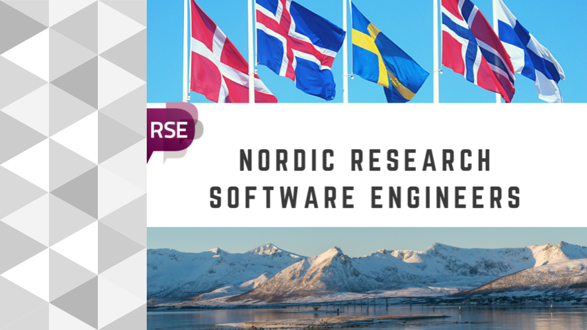
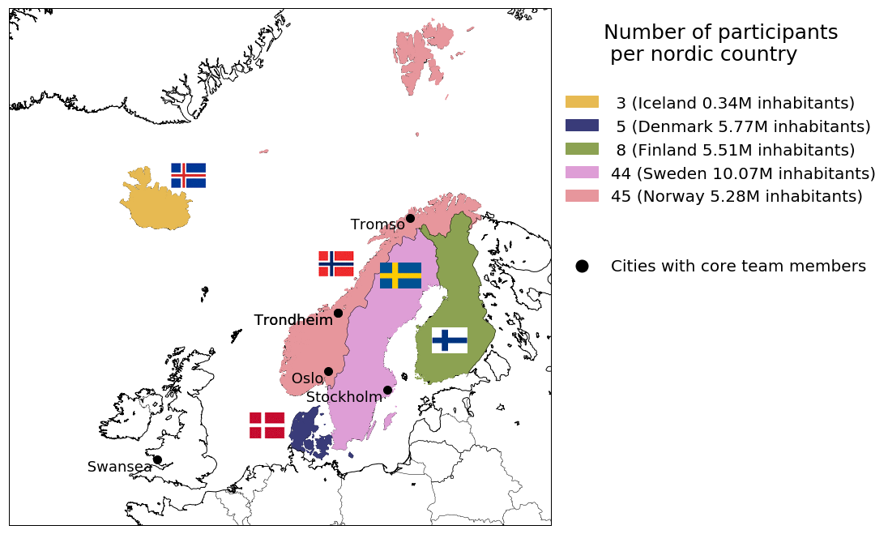

name: inverse
layout: true
class: middle, inverse

---

# Nordic-RSE Conference December 2020

---

layout: false

## History of Research Software Engineer initiatives

- In the last 2 decades, there has been a rapid increase in software use across all academic disciplines.

- Concerns over the reliability and reproducibility of that software.

- Software engineering skills are needed in research groups.

- The term "Research Software Engineer" was first coined in 2012 at Queen’s College Oxford 

- creation of the UK RSE Association, which in January 2018 numbers over 1200 members (growing monthly by 55 new members) https://www.software.ac.uk/blog/2016-11-24-not-so-brief-history-research-software-engineers

- UK initiative followed by USA, Canada, Brazil, Australia, New Zealand, Netherlands, Germany, France, Namibia, Sudan

---

## What is an RSE?

RSE: Research Software Engineer

> *A growing number of people in academia combine expertise in*
> *programming with an intricate understanding of research. Although*
> *this combination of skills is extremely*
> *valuable, these people lack a formal place in the academic system. This means*
> *there is no easy way to recognise their contribution, to reward them,*
> *or to represent their views*

Different backgrounds:

- Some RSEs start off as researchers who spend time developing software 
- Others start off from a more conventional software-development background and are drawn to research

---

## Why RSEs are important to research

[Reproducibility crisis](https://www.nature.com/news/1-500-scientists-lift-the-lid-on-reproducibility-1.19970):

> More than 70% of researchers have tried and failed to reproduce
> another scientist's experiments, and more than half have failed to
> reproduce their own experiments.  

Reusability and reproducibility of software:
- Reinventing wheel effect is slowing down research progress and costs money
- Without access to software engineering expertise, research software is significantly
  less likely to meet the requirements of reliability and
  reproducibility that we expect from research 

---

# The Nordic RSE network

- Kicked off in a CodeRefinery meeting outside Stockholm in April 2018
- https://nordic-rse.org/

A professional community modeled after the UK RSE Association
dedicated to sharing the best practices in research software
development across the Nordic nations as well as advocating for the
recognition of this work's value in research circles. Current
memberscome from

- Academic research groups
- HPC facilities
- Research institutes
- University IT departments

---

## Nordic-RSE survey

Like other national initiatives, Nordic-RSE conducted a survey to learn about
the environment and background of people working in RSE-type positions.
- Full results: https://github.com/nordic-rse/RSE_intro_survey/blob/master/analysis/results_nordics_2018_narrative.ipynb

---

# 1st Nordic RSE Conference

**When**:  1-2 December, 2020   
**Where**: THS Student Union, KTH, Stockholm   
**Events**: plenary talks, workshops, lightning talks  
**Sponsors**: SeRC, SNIC, eSSENCE, You?  
**Contact**: nordic-rse-organizers@neic.no, nordic-rse-pc@neic.no  

---

## Call for sponsors

#### Gold: 10000 EUR
- Up to negotiation.

#### Silver: 5000 EUR
- 1 Workshop
- Stall in the conference exhibition
- 2 conference registrations included
- Slide in the looped slide show before/between presentation slots (including keynotes) in the main conference room
- 1 direct communication of 150 words included in emails from the organizers to attendees
- Logo placement on the conference website
- Dedicated tweet from @nordic-rse

#### Bronze: 2000 EUR

#### Poster award: 600 EUR

#### Travel grants: 500 EUR

#### Support: 500 EUR

---

## Who should attend?

Our aim is to reflect the diverse and emerging community of RSEs
by seeking input from all levels of experience and across a variety
of domains, genders, and ethnicities.

1. Researchers at any career stage
2. Software developers working in a research context
3. Those interested in developing research software best practices
4. People providing tools, platforms or services that benefit research software
5. Anyone with a stake in research soǒtware (funders, publishers, decision makers, etc). 

We especially encourage first-time presenters and can offer mentoring
and other support with preparing your contribution

---

## Why you should attend

1. Show off your own research software best practices
2. Support a community of future potential collaborators
3. Learn from the community
4. Chat with like-minded software developers and researchers
5. Have an impact on the growth trajectory of this community

---

---

# Thank you for your attention!

